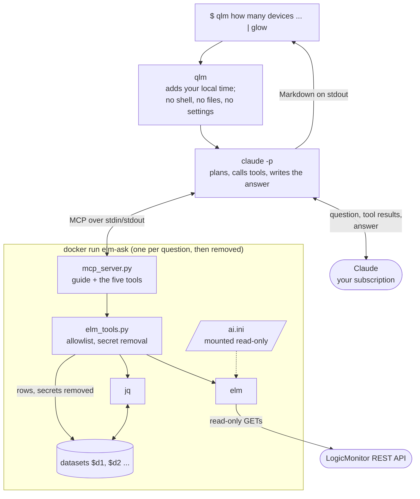
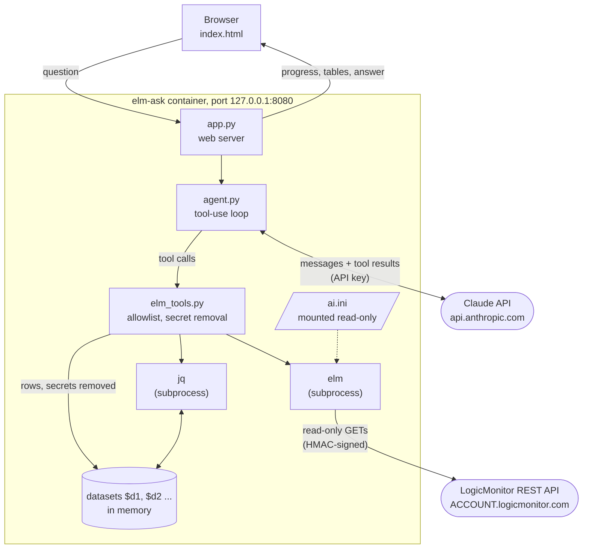
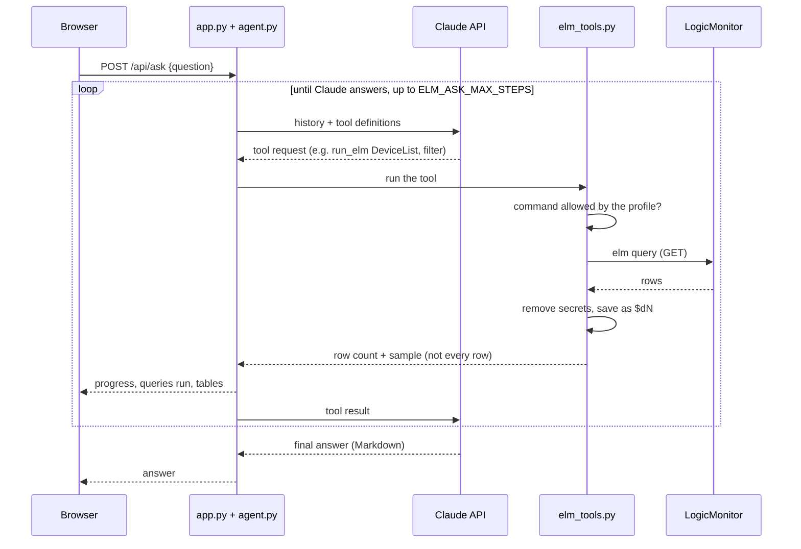

# elm ask

A local web page where anyone can ask questions about a LogicMonitor portal in
plain English:

- "Show me all the Windows devices that have alerts"
- "Show me SNMP errors older than 1 week"
- "What devices have alerting disabled?"

Claude works out which elm queries answer the question, runs them, and replies
with a short answer, sortable tables, caveats, and a
"How I worked this out" section plus the exact queries it ran.

Each answer carries two buttons: **Markdown** shows the whole answer -- question,
text, tables as Markdown tables, and the queries behind it -- ready to copy into
a ticket, a wiki page or a chat, or to download as `.md`; **CSV** downloads its
tables for spreadsheet work. The title goes back to a fresh page.

It runs in a Docker container on the user's own machine, so nobody needs elm,
Python or jq installed.

**Status: prototype.**

## How it keeps data safe

- **Read-only.** Every LogicMonitor call goes through elm, which only has GET
  commands. The model can pick a command, filter, fields and paging. It cannot
  pass global elm flags, so it can't reach `-f api`, `-f curl` or `-f wget`
  (those print the signed Authorization header).
- **Secrets removed.** Before the model, jq or the page see a row, elm-ask removes fields that can
  carry secrets (collector `bearerToken` and config blobs, API token keys) and masks
  credential-like property values that LogicMonitor has not already masked. It
  also drops personal contact details (`contacts`, `email`, `phone`): no
  question elm-ask is for needs them. A question that really is about people
  ("are the portal contacts the same on both portals?") would need them back,
  and pseudonyms rather than removal -- the web page could show the real names
  in its tables, since those do not pass through the model, but qlm's answer is
  the model's own text, so there the names could not be restored.
- **Its own restricted profile.** elm-ask uses the `ai` profile, not your default
  `config`, and refuses to answer until `ai.ini` exists and sets
  `allowed_commands`. You have to create it on purpose, so an everyday token with
  wide rights is never the one the assistant uses by accident. elm-ask only
  offers and runs the commands that profile allows, and the model cannot choose
  another profile or config file.
- **An allowlist limits commands, not data.** Several allowed commands carry
  people's names: `SDTList` has the `admin` who created the downtime, `AlertList`
  has `ackedBy`, `DeviceList` has `createdBy`. Asked for "a list of users",
  elm-ask correctly says it cannot produce one and points at the LogicMonitor
  UI, but it can still name whoever appears in those fields. If that matters,
  give the profile's token a LogicMonitor role that cannot see those areas; that
  decides what data exists at all, which no list of commands can.
- **Read-only token.** Give it an LM API token whose role is read-only. That is
  the guarantee that holds even if everything else is wrong.
- **Local only.** The commands below publish the port on `127.0.0.1`, so only
  the person at that machine can open the page.
- **What leaves the machine.** Questions and the query results the model reads
  are sent to the Claude API. Tables shown on screen are rendered locally, but
  counts, samples and summaries do go to the API. Check that this is acceptable
  under your organisation's data policy.

## What you need

1. Docker (e.g. Docker Desktop, or Colima on macOS).
2. A Claude API key (`ANTHROPIC_API_KEY`).
3. An `ai` profile (`tools/elm-check-access.sh -p ai` reports which commands its
   token can really reach): copy [`ai.example.ini`](../../ai.example.ini) to
   `~/.config/logicmonitor/credentials/ai.ini`, fill in an API token whose
   LogicMonitor role is read-only, and adjust `allowed_commands` if you need to.
   The page tells you if the profile is missing or has no `allowed_commands`.

## Build

From the repository root:

```shell
docker build -f tools/elm-ask/dockerfile -t elm-ask .
```

The build renders elm from `_jnja/` and the committed swagger snapshots inside
the image. It does not use your local `venv/`, `_cmds/` or `_dist/`.

The image holds its own copy of everything, so **rebuild after changing any of
it**: the templates in `_jnja/`, `elm-notes.yaml`, `elm-knowledge.md`, or the
files in `tools/elm-ask/`. Nothing in the running container reads your working
tree, so an edit you have not rebuilt is simply not there. Docker caches the
layers, so a rebuild after editing only `tools/elm-ask/` takes seconds; a
template change re-renders elm and takes longer. Credentials and the model are
read at run time, so changing those needs no rebuild.

If the build (or qlm) fails with `failed to connect to the docker API at
unix:///var/run/docker.sock`, the daemon is not running or its socket is
elsewhere; see [When it will not answer](#when-it-will-not-answer).

### Behind a proxy that inspects TLS

On a corporate network that decrypts outbound traffic, the build fails at
`pip install` with `certificate verify failed: unable to get local issuer
certificate`: the proxy presents its own certificate, and the image trusts
neither it nor anything signed by it. Put your organisation's root CA in
`tools/elm-ask/certs/`, as a file ending in `.crt`, and build again:

```shell
cp ~/corporate-root.pem tools/elm-ask/certs/corporate-root.crt
docker build -f tools/elm-ask/dockerfile -t elm-ask .
```

Both stages trust everything in that directory before they install anything
(`update-ca-certificates` reports `1 added`), and both pip and elm's own
requests are pointed at the system bundle, because each otherwise trusts a
certifi file of its own. Certificates there are not committed, and an empty
directory changes nothing, so the same build works on a network that inspects
nothing.

Two consequences worth knowing: the image then trusts that CA for everything,
so do not push it to a shared registry, and `ELM_CACERT` should not be needed
-- elm reaches LogicMonitor through the same bundle, via `REQUESTS_CA_BUNDLE`.
If a query still fails to verify the certificate, say so explicitly:

```shell
ELM_CACERT=/etc/ssl/certs/ca-certificates.crt qlm ...
```

qlm passes that through as `elm --cacert`, which overrides everything else.
The path is the one inside the container, and that bundle is where the CA from
`certs/` ends up.

Getting the certificate is a local matter (Keychain Access on macOS exports it
as a `.pem`, which can simply be renamed); your IT people are the source of
truth. Docker itself must trust it too, or it cannot even pull the base images:
that is a setting of your Docker runtime, not of this build.

## Run

`tools/elm-ask/run.sh` wraps the `docker run` below and asks which model and
effort to use:

```shell
export ANTHROPIC_API_KEY=...        # once per terminal, or see below
tools/elm-ask/run.sh                # asks, then starts
tools/elm-ask/run.sh -y             # no questions, image defaults
tools/elm-ask/run.sh -m claude-sonnet-5 -e medium -y
tools/elm-ask/run.sh --profile ai-preprod --port 8081 -y
```

Asked for the model, it offers the usual few by number (dearest first, with a
line on what each trades away); any other model name works too, and Enter keeps
the image's default. It checks the key and the profile before starting, builds
the image with `--build`, and prints the command instead of running it with
`--dry-run`.
`run.sh -h` lists everything. The plain commands below do the same thing by
hand (and are what Windows needs).

On macOS the key can live in the keychain instead, so no terminal and no file
ever holds it. Store it once (the command prompts, so the key stays out of your
shell history):

```shell
security add-generic-password -a "$USER" -s anthropic-api-key -w
```

`run.sh` reads it from there whenever `ANTHROPIC_API_KEY` is unset, and says
how to store it when there is nothing to read. `ELM_ASK_KEYCHAIN_ITEM` names a
different item. qlm needs none of this: it answers on your Claude login.

macOS / Linux:

```shell
docker run --rm -p 127.0.0.1:8080:8080 --user "$(id -u)" \
  --cap-drop ALL --security-opt no-new-privileges \
  -e ANTHROPIC_API_KEY -e ELM_CONFIG=/creds/ai.ini \
  -v ~/.config/logicmonitor/credentials/ai.ini:/creds/ai.ini:ro \
  elm-ask
```

Windows (PowerShell):

```powershell
docker run --rm -p 127.0.0.1:8080:8080 `
  --cap-drop ALL --security-opt no-new-privileges `
  -e ANTHROPIC_API_KEY -e ELM_CONFIG=/creds/ai.ini `
  -v "$env:USERPROFILE\.config\logicmonitor\credentials\ai.ini:/creds/ai.ini:ro" `
  elm-ask
```

`--user "$(id -u)"` runs the container as you, so it can read your profile
(elm keeps credentials at mode 0600). Without it the page says the profile was
not found. Only that one profile is mounted, so the container never holds the
rest of your credentials, and it drops the Linux capabilities elm has no use
for.

Then open <http://localhost:8080>.

### Choosing the profile

This uses the `ai` profile (`ai.ini`). To use a different one:

`run.sh --profile ai-preprod` is the short way. By hand, mount whichever `.ini`
you mean and name it with `ELM_CONFIG`; it may live anywhere, not only in the
credentials folder:

```shell
docker run --rm -p 127.0.0.1:8080:8080 --user "$(id -u)" \
  --cap-drop ALL --security-opt no-new-privileges \
  -e ANTHROPIC_API_KEY -e ELM_CONFIG=/creds/ai-preprod.ini \
  -v ~/.config/logicmonitor/credentials/ai-preprod.ini:/creds/ai-preprod.ini:ro \
  elm-ask
```

`ELM_PROFILE=NAME` still works, for a container with the whole credentials
folder mounted at `/home/app/.config/logicmonitor/credentials`; `ELM_CONFIG`
wins when both are set. Either way the profile must set
`allowed_commands`, unless you also add `-e ELM_ASK_ALLOW_UNRESTRICTED=1`. The
page footer names the portal and the profile, and its "N allowed commands" is a
button that lists them.

One elm-ask talks to one portal. For several, run one container per profile on
different ports (e.g. `ai-prod` on 8080, `ai-preprod` on 8081).

## Settings

| Variable | Default | Purpose |
|---|---|---|
| `ANTHROPIC_API_KEY` | (required) | Claude API key |
| `ANTHROPIC_BASE_URL` | Anthropic API | Send Claude requests through a gateway instead |
| `ELM_PROFILE` | `ai` | Credential profile name, as `elm --profile`. Must set `allowed_commands` |
| `ELM_ASK_ALLOW_UNRESTRICTED` | | Set to `1` to allow a profile without `allowed_commands` |
| `ELM_CONFIG` | | Path to a specific `.ini` inside the container (overrides `ELM_PROFILE`) |
| `ELM_CACERT` | | CA bundle for networks that inspect TLS, as `elm --cacert` (mount the file too; unnecessary if the CA was built in, see [Build](#behind-a-proxy-that-inspects-tls)) |
| `ELM_ASK_MODEL` | the cheapest current model (see `agent.py`) | Claude model to answer with (the page footer shows the one in use) |
| `ELM_ASK_EFFORT` | API default | How hard the model works per step; lower is faster and cheaper |
| `ELM_ASK_MAX_STEPS` | `25` | Maximum model turns per question |

### Cost: model and effort

Answers cost per question, so these two are the dials worth knowing. Both are
set when starting (`run.sh -m ... -e ...`, or the environment variables
below), and neither needs a rebuild:

```shell
docker run --rm -p 127.0.0.1:8080:8080 --user "$(id -u)" \
  -e ANTHROPIC_API_KEY -e ELM_ASK_MODEL=claude-sonnet-5 -e ELM_ASK_EFFORT=medium \
  -v ~/.config/logicmonitor/credentials:/home/app/.config/logicmonitor/credentials:ro \
  elm-ask
```

- **Model.** The default is the cheapest current model: these are lookup
  questions, and every one costs money. A mid-tier or top model is more careful
  on multi-step questions (joining alerts to devices, paging, noticing a filter
  the API ignored) and costs several times as much. Names and prices are on
  Anthropic's pricing page; the footer shows which model answered.
- **Effort.** Lower effort means less thinking per step, so less money and less
  time, at some cost in care. Try it before dropping to a weaker model. Not
  every model takes it (the small ones refuse it); elm-ask notices, says so and
  carries on without it, so the setting is safe to leave on.

Judge both on answers, not on price alone: a cheaper model that needs three
attempts is not cheaper. That is what the question set in `todo.md` is for.

## qlm: ask from the command line

`qlm` asks the same questions from a terminal, and prints the answer as
Markdown, so it pipes:

```shell
qlm how many devices are in SDT right now
qlm "which collectors are down?" | glow
```



It runs Claude Code (`claude -p`) on your own Claude login, not an API key, and
gives it only elm-ask's tools: no shell, no files. The tools come from
`mcp_server.py`, which runs in the `elm-ask` image, one container per question,
with the `ai` profile mounted read-only. It is for your own use on your own
machine: a Claude login is one person's.

Needs Claude Code (logged in), Docker, the image (see [Build](#build)) and the
`ai` profile. Claude Code must be recent enough for `--restricted` and to wait
for MCP servers in `-p` mode: 2.1.236 lacks the flag and 2.1.220 answered
before the server connected, saying "the elm tools did not load"; 2.1.277 does
both. qlm checks for the flag and says so, so the fix is `claude update`. Then put it on your `PATH`:

```shell
ln -s "$PWD/tools/elm-ask/qlm" ~/bin/qlm
```

qlm uses only profiles named `ai` or `ai-something` (`ai-acme`,
`ai-preprod`), so a mistyped `QLM_PROFILE` cannot reach your everyday token. It
is a guard against your own slip, not a boundary: what a profile may do is set
by its `allowed_commands` and by its token's LM role, never by its name.

`qlm --info` says what a question would use -- the profile and its file, the
portal, the allowed command count, elm's version, when the image was built, and
which Claude Code answers -- and `qlm --help` lists the rest. `mcp_server.py
--info` prints the portal half of that on its own.

`QLM_MODEL` picks another model (default `sonnet`). Each question starts
afresh: there are no follow-ups.

`QLM_LOG=1` records each question in `$XDG_STATE_HOME/qlm/qlm.log`
(`~/.local/state/qlm/qlm.log`), or in the file you name instead; it is off
unless set. A line is the time, the profile and the question, in a file only
you can read, because a question can name a device or a site. Answers are
never written down: they carry portal data, and LM's audit log already holds
every request the token made (`elm AuditLogList -F username:ACCESS_ID`).

Only the profile in use is mounted, as a single file, so the container holds
that one token and not every credential you own. It also runs with
`--cap-drop=ALL --security-opt=no-new-privileges`: elm needs neither.

### When it will not answer

- **`qlm: the elm tools did not load`** -- Claude Code answered before the MCP
  server connected, or the server failed to start. Check the server by hand:
  `echo '{"jsonrpc":"2.0","id":1,"method":"tools/list"}' | docker run -i --rm
  elm-ask python /opt/elm/tools/elm-ask/mcp_server.py` should print a tool list.
- **`failed to connect to the Docker API at unix:///var/run/docker.sock ...
  connect: no such file or directory`** -- no Docker daemon is listening there.
  Either it is not running (start Docker Desktop, or `colima start`), or it
  keeps its socket elsewhere: Docker Desktop on macOS uses
  `~/.docker/run/docker.sock` and Colima `~/.colima/default/docker.sock`. Point
  Docker at it with `export DOCKER_HOST=unix://$HOME/.docker/run/docker.sock`
  (`docker context ls` shows which socket the current context uses).
- **`Failed to authenticate: OAuth session expired and could not be
  refreshed`** -- Claude Code's own login, not qlm: run `claude`, `/login`, and
  try again. `claude setup-token` avoids repeating it.
- **A message about `allowed_commands`** -- the profile is missing, or does not
  restrict commands; the answer names which.

### Asking two portals at once

`QLM_PROFILE` names the profile to use, and it can name more than one:

```shell
QLM_PROFILE="ai-prod ai-preprod" qlm which collectors are in prod but not preprod
```

Each profile gets its own container and its own tools
(`mcp__elm_ai_prod__run_elm`, `mcp__elm_ai_preprod__run_elm`), so one question
can compare portals. Each container keeps its own datasets, so a single jq
expression cannot join across portals: the answer compares what each portal
returned. Two portals means two containers and two `guide` calls, so it costs
more than asking one.

### The same tools elsewhere

`mcp_server.py` is an MCP server: a program that offers tools to any Claude
Code session. It speaks MCP over stdin and stdout, so it needs no port. To give
an interactive Claude Code session the tools:

```shell
claude mcp add elm -- docker run -i --rm --user "$(id -u)" \
  -v ~/.config/logicmonitor/credentials:/home/app/.config/logicmonitor/credentials:ro \
  elm-ask python /opt/elm/tools/elm-ask/mcp_server.py
```

To give them to Docker sandboxes (`sbx`), register the same command. It runs on
the host, so the credentials stay there and the sandbox only sees the answers:

```shell
sbx mcp add elm --command docker --args "run,-i,--rm,--user,$(id -u),-v,$HOME/.config/logicmonitor/credentials:/home/app/.config/logicmonitor/credentials:ro,elm-ask,python,/opt/elm/tools/elm-ask/mcp_server.py"
```

Claude Code keeps only the first 2048 characters of a server's instructions,
so the server's say "call `guide` first", and the `guide` tool returns
`system_prompt.md` and `elm-knowledge.md` in full.

## Run without Docker (development)

With elm built locally (`_cmds/`, `engine.py` and `elm.py` present) and `jq` on `PATH`:

```shell
pip install -r requirements.txt -r tools/elm-ask/requirements.txt
ANTHROPIC_API_KEY=... python tools/elm-ask/app.py      # http://127.0.0.1:8080
```

## How it works

The container is a small Python web server. It talks to Claude and to
LogicMonitor itself; the browser only ever talks to the container. Claude never
reaches LogicMonitor directly: it asks for a tool, and elm-ask decides whether
to run it.



One question, step by step:



| File | Role |
|---|---|
| `run.sh` | Starts the container, asking for the model and effort |
| `app.py` | Serves the page and streams answers from `/api/ask` as newline-delimited JSON |
| `agent.py` | The Claude tool-use loop |
| `mcp_server.py` | The same tools as an MCP server, for `qlm` and Claude Code |
| `qlm` | Asks from the command line through `mcp_server.py` |
| `elm_tools.py` | The five tools: `find_commands`, `describe_command`, `run_elm`, `jq` and `show_table` |
| `system_prompt.md` | How to interpret questions and write answers |
| `../../elm-knowledge.md` | Sent with every question: rules that apply across commands |
| `elm COMMAND --info` | Per-command notes and fields (from `elm-notes.yaml` and the swagger). `describe_command` returns all of it; the first query against a command also gets that command's notes attached, so a model that skips the lookup still sees them |

Each query's rows are saved as a dataset (`$d1`, `$d2`, ...) for that
conversation. The model counts, groups and joins them with jq instead of
reading every row.

## Making answers better

Most wrong answers come from plain words that don't map directly onto an API
field. For example, alert names don't say "SNMP", and the OS property can
reflect the collector rather than the device. When the tool gets something
wrong, record the lesson rather than changing the code: in `elm-notes.yaml` if
it is about one command, or in `elm-knowledge.md` if it applies across commands.
Keep `elm-knowledge.md` short, because it is sent with every question.

## Limitations

- It is built to run on one person's machine for that person: no login, the
  port bound to localhost, the user's own Claude key and LogicMonitor token.
  Hosting it for other people needs more first: authentication, TLS, a shared
  key with spend limits, a record of who asked what, and agreement on where
  portal data may be sent.
- A single elm query returns at most 1000 rows. The model is told to page, but
  very large portals make questions slower and more expensive.
- Conversations are kept in memory and dropped after an hour idle or when the
  container stops.
- Answers can be wrong. The "Queries run" list is there so they can be checked.
